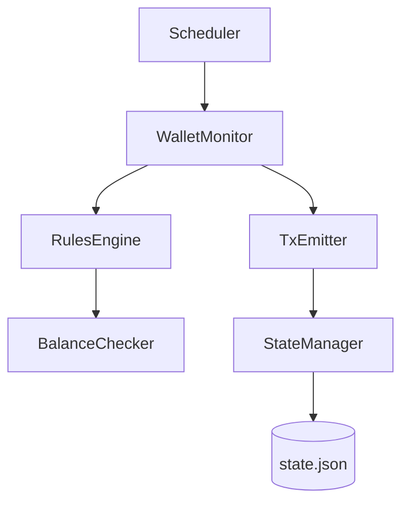

# Treasury Sweeper Service

## Table of Contents

1. [System Overview](#1-system-overview)
2. [Setup and Usage](#2-setup-and-usage)
3. [State Management](#3-state-management)
4. [Data Models](#4-data-models)
5. [Scenarios and Decision Flow](#5-scenarios-and-decision-flow)
6. [Assumptions and Trade-offs](#6-assumptions-and-trade-offs)

---

## 1. System Overview

### Architecture

The Treasury Sweeper is a multi-chain wallet monitoring and fund consolidation service designed to automatically sweep funds from hot wallets to a central treasury when configurable thresholds are met.



### Components

1. **Scheduler**: Orchestrates sweep cycles (single or continuous execution)
2. **WalletMonitor**: Coordinates balance checking and sweep execution across all wallets
3. **RulesEngine**: Evaluates sweep rules (native balance, token balance) against current balances
4. **BalanceChecker**: Simulates blockchain balance queries
5. **TxEmitter**: Builds and "submits" mock transactions with proper nonce management
6. **StateManager**:- Provides atomic nonce reservation and persistent state


---

## 2. Build
```bash
# Clone the repository
cd treasury_sweeper

# Build the project
cargo build --release

# Run tests
cargo test
```


### Configuration

#### Initialize Configuration and State

```bash
# Generate config.json and state.json with 3 hot wallets
cargo run -- init-state \
  --num-wallets 3 \
  --interval 60 \
  --eth-threshold 0.1 \

# Output:
# - config.json: Configuration with treasury and hot wallet addresses
# - state.json: Initial state with all nonces at 0
```


**Key Configuration Parameters**:

- `treasury_address`: Destination address for all sweeps
- `hot_wallets`: Array of wallets to monitor
  - `address`: Wallet address
  - `label`: Human-readable identifier
  - `rules`: Array of sweep rules
- `sweep_interval_seconds`: Time between sweep cycles (continuous mode)

### Running the Service

#### Single Sweep Cycle

Execute one sweep cycle and exit:

```bash
cargo run -- -config config.json --state state.json once
```


#### Continuous Mode

Run continuous sweep cycles:

```bash
cargo run -- --config config.json --state state.json continuous
```

**Output**:
```
INFO Starting continuous sweep mode (interval: 60s)
INFO Sweep cycle complete: 2 sweeps executed
INFO Waiting 60 seconds until next cycle...
INFO Sweep cycle complete: 1 sweeps executed
...
```

### Reset State


```bash
# Delete state file to start fresh
rm state.json

# Re-initialize
cargo run -- init-state --num-wallets 3 --interval 60 --eth-threshold 0.1
```

---


**Recovery**: On restart, load `state.json` and continue from last persisted nonces.

---

## 3. Data Models

### Configuration Schema

```json
{
  "treasury_address": "0x8e886329b47092fa8218262fdf3285766120fec6",
  "hot_wallets": [
    {
      "address": "0xf28d770cd214eca70c71964a72e4e9ab5e88a8f8",
      "label": "Hot Wallet 1",
      "rules": [
        {
          "native_balance": {
            "threshold": "0.1",
            "asset": "ETH"
          }
        },
        {
          "token_balance": {
            "threshold": "100000000",
            "token_address": "0xA0b86991c6218b36c1d19D4a2e9Eb0cE3606eB48",
            "asset": "USDC"
          }
        }
      ]
    }
  ],
  "sweep_interval_seconds": 60
}
```

### State Schema

```json
{
  "wallets": {
    "0xf28d770cd214eca70c71964a72e4e9ab5e88a8f8": {
      "address": "0xf28d770cd214eca70c71964a72e4e9ab5e88a8f8",
      "next_nonce": 5,
      "total_sweeps": 5,
      "last_sweep_timestamp": "2024-11-24T05:30:00Z"
    }
  },
  "last_update": "2024-11-24T05:30:00Z"
}
```


---

## 4. Scenarios and Decision Flow

### Scenario 1: Single Wallet, Single Rule Trigger

**Setup**: Wallet has 0.5 ETH, threshold is 0.1 ETH

**Flow**:
1. Scheduler triggers sweep cycle
2. Monitor checks wallet
3. RulesEngine evaluates: 0.5 > 0.1 → **TRIGGER**
4. TxEmitter reserves nonce (0)
5. Build transaction, persist state
6. Log sweep submission

**Result**: 1 sweep executed, nonce incremented to 1

### Scenario 2: Multiple Rules, All Trigger

**Setup**: Wallet has 0.8 ETH and 150 USDC, thresholds are 0.1 ETH and 100 USDC

**Flow**:
1. RulesEngine evaluates both rules
2. ETH rule: 0.8 > 0.1 → **TRIGGER**
3. USDC rule: 150 > 100 → **TRIGGER**
4. TxEmitter reserves nonce (0) for ETH sweep
5. TxEmitter reserves nonce (1) for USDC sweep
6. Both transactions built and logged

**Result**: 2 sweeps executed in one cycle, nonce incremented to 2

### Scenario 3: Multiple Wallets, Concurrent Processing

**Setup**: 3 wallets, all above threshold

**Flow**:
1. Monitor processes wallets sequentially
2. Wallet A: Reserve nonce (0), sweep
3. Wallet B: Reserve nonce (0), sweep 
4. Wallet C: Reserve nonce (0), sweep

**Result**: 3 sweeps, each wallet has independent nonce=1

### Scenario 4: Threshold Not Met

**Setup**: Wallet has 0.05 ETH, threshold is 0.1 ETH

**Flow**:
1. RulesEngine evaluates: 0.05 < 0.1 → **NO TRIGGER**
2. No sweep decision created
3. No nonce consumed

**Result**: 0 sweeps, nonce unchanged

### Scenario 5: Service Restart Mid-Operation

**Setup**: Service crashes after reserving nonce but before transaction submission

**Flow**:
1. Before crash: Nonce 5 reserved, state persisted (next_nonce=6)
2. **CRASH**
3. Restart: Load state from disk
4. Next sweep: Reserve nonce 6 (continues from persisted state)

**Result**: Nonce 5 is "lost" but transaction not submitted

---

## 5. Assumptions and Trade-offs

### Assumptions

1. **Mock Environment**: All blockchain interactions are simulated
2. **Single Process**: Only one instance of the service runs at a time

### Trade-offs

* **Nonce Consumption**: Nonce is consumed on failure.
* **File-Based State**: State is perceived in simple json format..
* **All Rules per Cycle**: Running all rules speeds consolidation but uses more nonces.
* **Per-Wallet Locking**: Per-wallet locks enable parallelism but add complexity.


